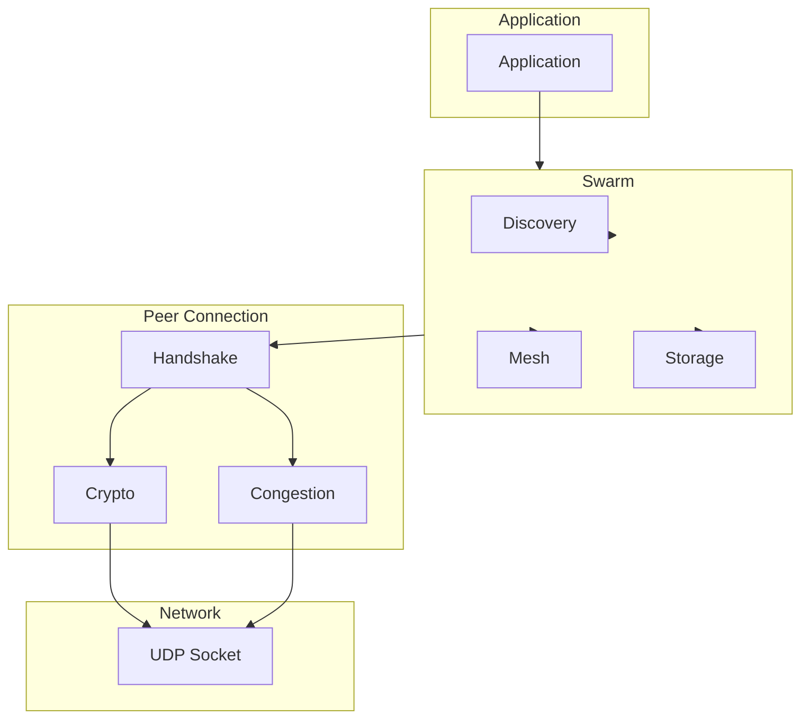
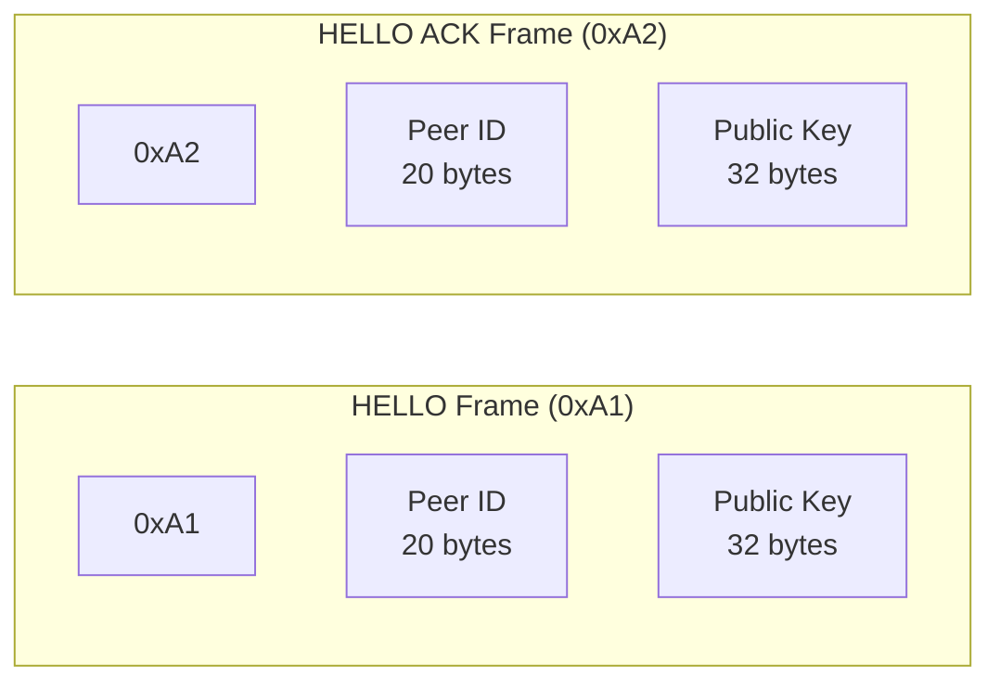
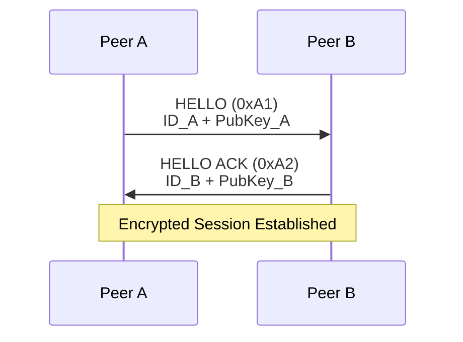
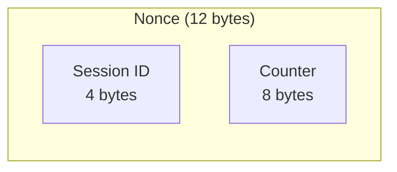
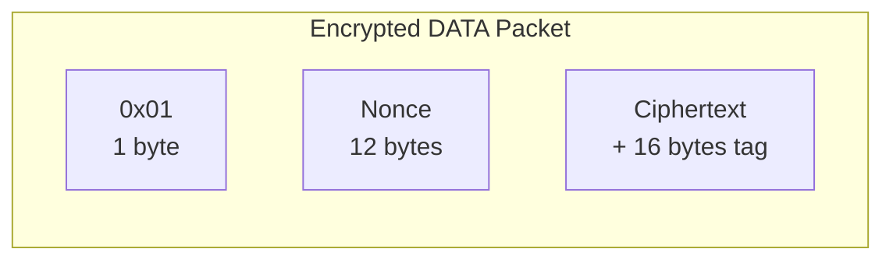
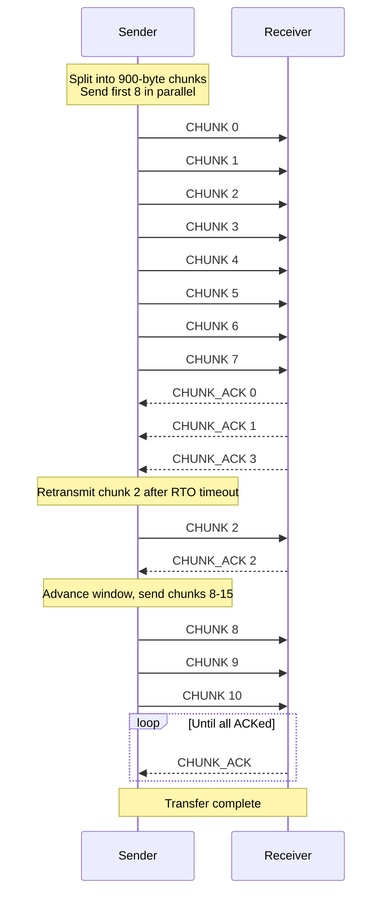
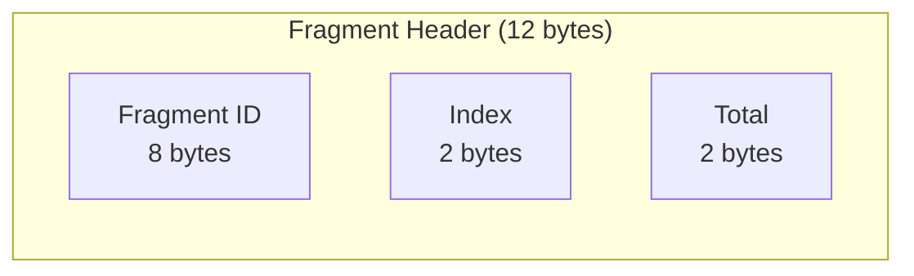

# Setowire Technical Specification

## Overview

Setowire is a lightweight, portable P2P networking library built on UDP. It enables direct peer-to-peer communication without central servers or brokers. This specification documents the complete technical implementation in Rust, matching the JavaScript reference implementation.

---

## Architecture

### Core Components



---

## Configuration

### SwarmConfig Options

| Option | Type | Default | Description |
|--------|------|---------|-------------|
| `seed` | `Option<String>` | `None` | 32-byte hex string for deterministic identity |
| `max_peers` | `Option<usize>` | `100` | Maximum simultaneous connections |
| `relay` | `Option<bool>` | `false` | Force relay mode regardless of NAT |
| `bootstrap` | `Option<Vec<String>>` | `[]` | Bootstrap nodes as `["host:port"]` |
| `seeds` | `Option<Vec<String>>` | `[]` | Additional hardcoded seed peers |
| `storage` | `Option<Box<dyn StorageBackend>>` | `None` | Pluggable storage backend |
| `store_cache_max` | `Option<usize>` | `10000` | Max entries in memory cache |
| `on_save_peers` | `Option<SavePeersCallback>` | `None` | Called when peer cache updates |
| `on_load_peers` | `Option<LoadPeersCallback>` | `None` | Called on startup to restore peers |

### Storage Backend Trait

```rust
pub trait StorageBackend: Send + Sync {
    fn save_peers(&self, peers: &[(String, String, u16)]);
    fn load_peers(&self) -> Vec<(String, String, u16)>;
}
```

### Memory Storage Implementation

```rust
pub struct MemoryStorage {
    peers: Arc<Mutex<Vec<(String, String, u16)>>>,
}
```

---

## Events System

### Event Callbacks

| Event | Signature | Description |
|-------|----------|-------------|
| `connection` | `Fn(&Peer) -> ()` | New peer connected |
| `data` | `Fn(&[u8], &Peer) -> ()` | Message received |
| `disconnect` | `Fn(&str) -> ()` | Peer disconnected |
| `sync` | `Fn(&str, &[u8]) -> ()` | Value received from network |
| `nat` | `Fn() -> ()` | Public address discovered |

### Usage

```rust
let mut swarm = Swarm::new_with_config(config).await;

swarm.on_connection(Box::new(|peer| {
    println!("New peer: {}", peer.id);
}));

swarm.on_data(Box::new(|data, peer| {
    println!("Received: {:?}", data);
}));

swarm.on_disconnection(Box::new(|peer_id| {
    println!("Disconnected: {}", peer_id);
}));

swarm.on_sync(Box::new(|key, value| {
    println!("Sync: {} = {:?}", key, value);
}));

swarm.on_nat(Box::new(|| {
    println!("NAT discovered");
}));
```

---

## Wire Protocol

### Frame Types

All packets start with a 1-byte frame type:

| Byte | Type | Description |
|------|------|-------------|
| `0x01` | DATA | Encrypted application data |
| `0x03` | PING | Keepalive + RTT measurement |
| `0x04` | PONG | Keepalive reply |
| `0x0A` | GOAWAY | Graceful disconnect |
| `0x0B` | FRAG | Fragment of large message |
| `0x10` | HAVE | Announce available keys |
| `0x11` | WANT | Request a key |
| `0x12` | CHUNK | Data chunk |
| `0x13` | BATCH | Multiple frames in one datagram |
| `0x14` | CHUNK_ACK | Acknowledgement for reliable transfer |
| `0x20` | RELAY_ANN | Peer announcing as relay |
| `0x21` | RELAY_REQ | Request introduction via relay |
| `0x22` | RELAY_FWD | Relay forwarding introduction |
| `0x30` | PEX | Peer exchange |
| `0xA1` | HELLO | Handshake initiation |
| `0xA2` | HELLO_ACK | Handshake response |

### Handshake Protocol

The handshake consists of two frames:



### Handshake Flow



### Handshake Functions

```rust
/// Parse HELLO/HELLO_ACK frame with validation
pub fn parse_handshake_frame(frame: &[u8]) -> Option<(&[u8; 20], &[u8; 32])> {
    // Validate frame type: must be 0xA1 or 0xA2
    if frame.is_empty() || (frame[0] != F_HELLO && frame[0] != F_HELLO_ACK) {
        return None;
    }
    // Validate length: 1 + 20 + 32 = 53 bytes
    if frame.len() != 1 + 20 + 32 {
        return None;
    }
    let peer_id: &[u8; 20] = frame[1..21].try_into().ok()?;
    let public_key: &[u8; 32] = frame[21..53].try_into().ok()?;
    Some((peer_id, public_key))
}

/// Create HELLO frame (0xA1)
pub fn create_hello_frame(peer_id: &[u8; 20], public_key: &[u8; 32]) -> Vec<u8>

/// Create HELLO_ACK frame (0xA2)  
pub fn create_hello_ack_frame(peer_id: &[u8; 20], public_key: &[u8; 32]) -> Vec<u8>

/// Derive session with key flipping based on peer ID comparison
pub fn derive_session_flipped(
    my_private: &[u8; 32],
    their_public: &[u8; 32],
    my_id: &[u8; 20],
    their_id: &[u8; 20],
    session_id: u32
) -> Session
```

**Security:** `parse_handshake_frame` validates frame type to prevent parsing arbitrary data as handshake frames.

---

## Cryptography

### Key Exchange (X25519)

```rust
pub struct KeyPair {
    pub private: [u8; 32],  // Private key
    pub public: [u8; 32],   // Public key
}
```

### Deterministic Key Generation

```rust
pub fn generate_x25519(seed: Option<&[u8]>) -> KeyPair
```

- If `seed` is provided, derives deterministic keypair from seed
- If `seed` is `None`, generates random keypair

### Session Key Derivation

```rust
pub fn derive_session(
    my_private: &[u8; 32],
    their_public: &[u8; 32],
    session_id: u32
) -> Session
```

- Uses HKDF-SHA256 with label `p2p-v12-session`
- Derives 64 bytes: first 32 = send_key, second 32 = recv_key

### Session Key Flipping

```rust
pub fn derive_session_flipped(
    my_private: &[u8; 32],
    their_public: &[u8; 32],
    my_id: &[u8; 20],
    their_id: &[u8; 20],
    session_id: u32
) -> Session
```

- Compares peer IDs lexicographically
- Peer with lower ID uses first 32 bytes as send key
- Other peer flips send/recv keys

### Encryption (ChaCha20-Poly1305)

```rust
pub fn encrypt(session: &mut Session, plaintext: &[u8]) -> Vec<u8>
pub fn decrypt(session: &Session, data: &[u8]) -> Option<Vec<u8>>
```

**Nonce Format (12 bytes):**



**Encrypted Packet Format:**



---

## Reliable Chunk Transfer

### Overview

When a value larger than 900 bytes is requested via `fetch()`, the sender uses a sliding window protocol instead of fire-and-forget.

### Protocol Parameters

| Parameter | Value | Description |
|-----------|-------|-------------|
| CHUNK_SIZE | 900 bytes | Maximum data per chunk |
| WINDOW_SIZE | 8 | Initial window size |
| RTO | 1500 ms | Retransmission timeout |
| MAX_TIMEOUT | 60 seconds | Safety timeout |

### Chunk Transfer Flow



### Implementation

```rust
pub struct ChunkTransfer {
    pub key: String,
    pub total: u16,
    pub received: HashMap<u16, Vec<u8>>,
    pub window: u16,
    pub window_start: u16,
    pub next_expected: u16,
    pub start_time: Instant,
    pub rto: Duration,
    pub pending_ack: HashMap<u16, Instant>,
}
```

---

## Fragmentation

### Fragment Header (12 bytes)



### Fragment Assembly

```rust
pub struct FragmentAssembler {
    pending: HashMap<String, FragEntry>,
}

struct FragEntry {
    total: u16,
    pieces: HashMap<u16, Vec<u8>>,
    timer: Instant,
}
```

---

## Peer Management

### Peer State

```rust
pub struct Peer {
    pub id: String,                    // 20-byte hex string
    pub remote_addr: SocketAddr,       // Current address
    pub in_mesh: bool,                 // Mesh membership
    pub score: i32,                    // Mesh selection score
    pub rtt: f64,                      // Round-trip time (ms)
    pub bandwidth: f64,                 // Estimated bandwidth (B/s)
    session: Option<Session>,           // Encryption state
    // ... queues, congestion control, etc.
}
```

### Congestion Control

| Parameter | Value | Description |
|-----------|-------|-------------|
| CWND_INIT | 16 | Initial congestion window |
| CWND_MAX | 512 | Maximum congestion window |
| CWND_DECAY | 0.75 | Window decay factor after loss |

### Rate Limiting

| Parameter | Value | Description |
|-----------|-------|-------------|
| RATE_PER_SEC | 128 bytes/s | Rate limit |
| RATE_BURST | 256 bytes | Burst limit |

---

## Discovery

### Discovery Methods

1. **DHT** — Decentralized topic-based discovery
2. **LAN Multicast** — Instant discovery on local networks
3. **HTTP Bootstrap** — Fallback seed servers
4. **Peer Cache** — Remembers peers from previous sessions
5. **Piping Servers** — HTTPS rendezvous for strict NATs

### NAT Traversal

- **STUN** — NAT type detection
- **UDP Hole Punching** — Direct connectivity
- **Relay** — Full-cone NAT peers become relays

---

## Constants

### Network

```rust
pub const MAX_PEERS: usize = 100;
pub const MAX_ADDRS_PEER: usize = 4;
pub const PEER_TIMEOUT: u64 = 60_000;        // ms
pub const HEARTBEAT_MS: u64 = 1_000;         // ms
pub const PUNCH_TRIES: usize = 8;
pub const PUNCH_INTERVAL: u64 = 300;          // ms
```

### Protocol

```rust
pub const MAX_PAYLOAD: usize = 1200;
pub const FRAG_DATA_MAX: usize = 1188;       // MAX_PAYLOAD - FRAG_HDR
pub const SYNC_CHUNK_SIZE: usize = 900;
pub const BATCH_MTU: usize = 1400;
```

### Crypto

```rust
pub const TAG_LEN: usize = 16;               // Poly1305 tag
pub const NONCE_LEN: usize = 12;             // 4B session + 8B counter
```

---

## API Reference

### Swarm Construction

```rust
// Default configuration
let swarm = Swarm::new().await;

// Custom configuration
let config = SwarmConfig {
    seed: Some("00112233445566778899aabbccddeeff".to_string()),
    max_peers: Some(100),
    relay: Some(false),
    bootstrap: Some(vec!["1.2.3.4:5000".to_string()]),
    seeds: Some(vec![]),
    storage: Some(Box::new(MemoryStorage::new())),
    store_cache_max: Some(10000),
    on_save_peers: None,
    on_load_peers: None,
};
let swarm = Swarm::new_with_config(config).await;
```

### Methods

| Method | Signature | Description |
|--------|-----------|-------------|
| `id()` | `&str` | Get node ID |
| `nat_type()` | `&str` | Get NAT type |
| `public_addr()` | `Option<String>` | Get discovered public address |
| `max_peers()` | `usize` | Get max peers |
| `force_relay()` | `bool` | Check if relay forced |
| `bootstrap()` | `&[String]` | Get bootstrap nodes |
| `seeds()` | `&[String]` | Get seed peers |
| `public_key_hex()` | `String` | Get public key as hex |
| `join()` | `fn(&[u8], bool, bool)` | Join topic |
| `broadcast()` | `fn(&[u8]) -> usize` | Send to all peers |
| `store()` | `fn(&str, &[u8])` | Store value |
| `fetch()` | `async fn(&str) -> Option<Vec<u8>>` | Fetch value |
| `destroy()` | `async fn()` | Graceful shutdown |

### Event Handlers

```rust
swarm.on_connection(Box::new(|peer| { ... }));
swarm.on_disconnection(Box::new(|peer_id| { ... }));
swarm.on_data(Box::new(|data, peer| { ... }));
swarm.on_sync(Box::new(|key, value| { ... }));
swarm.on_nat(Box::new(|| { ... }));
```

---

## Porting to Other Languages

### Minimum Implementation Required

1. **X25519 key exchange** — Generate keypairs, perform DH
2. **HKDF-SHA256** — Derive session keys with label `p2p-v12-session`
3. **ChaCha20-Poly1305** — Encrypt/decrypt with 12-byte nonce
4. **Handshake frames** — 0xA1 (HELLO) and 0xA2 (HELLO_ACK)
5. **DATA frame** — 0x01 with encrypted payload
6. **PING/PONG** — 0x03/0x04 for keepalive

### Optional Features

- DHT for decentralized discovery
- Relay functionality
- Gossip protocol
- Peer exchange (PEX)
- Reliable chunk transfer

### Key Derivation Formula

```
shared_secret = X25519(my_private, their_public)
okm = HKDF-SHA256(
    salt = "p2p-v12-session",
    ikm = shared_secret,
    info = "",
    len = 64
)
send_key = okm[0:32]
recv_key = okm[32:64]
```

If peer ID is lexicographically greater than remote ID, flip send/recv keys.

---

## Security Considerations

1. **Forward Secrecy** — Session keys derived from ephemeral X25519 keys
2. **AEAD Encryption** — ChaCha20-Poly1305 provides authentication
3. **Nonce Uniqueness** — 12-byte nonce (4-byte session + 8-byte counter)
4. **Key Flipping** — Prevents bidirectional replay attacks

---

## Performance Characteristics

| Metric | Value |
|--------|-------|
| Latency | ~1 RTT for connection setup |
| Throughput | Limited by UDP bandwidth |
| Memory | ~1KB per peer |
| Connection Limit | Configurable (default 100) |

---

## References

- [Noise Protocol Framework](https://noiseprotocol.org/)
- [X25519: Elliptic Curve Diffie-Hellman](https://cr.yp.to/ecdh.html)
- [ChaCha20-Poly1305](https://cr.yp.to/chacha.html)
- [Kademlia DHT](https://pdos.csail.mit.edu/~petar/papers/maymounkov-kademlia-lncs.pdf)
